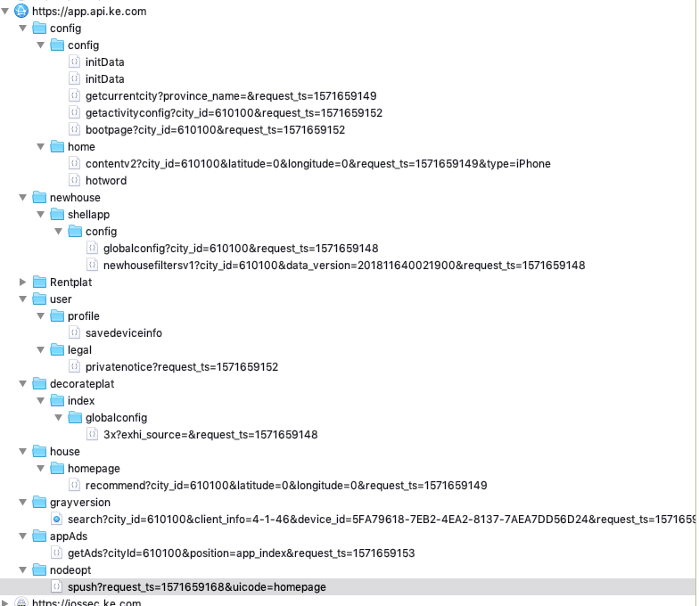
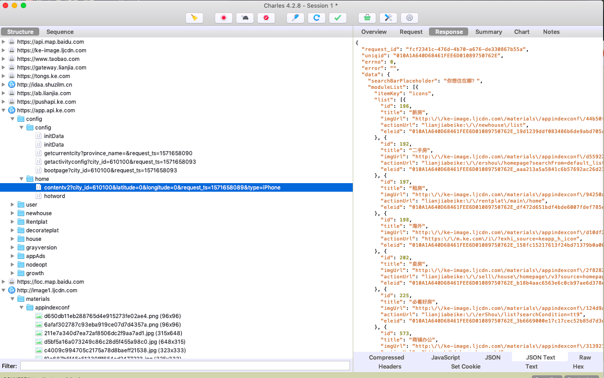
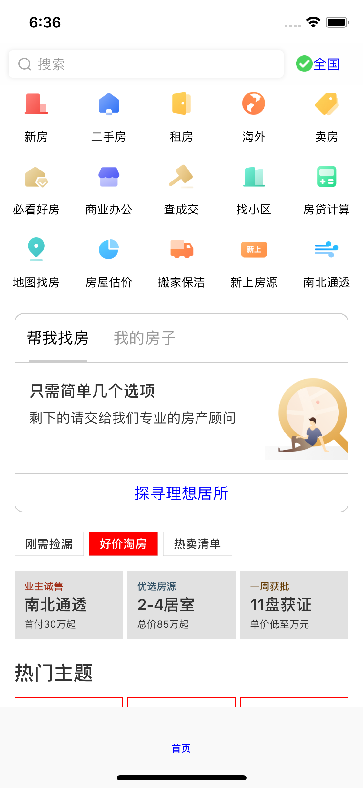
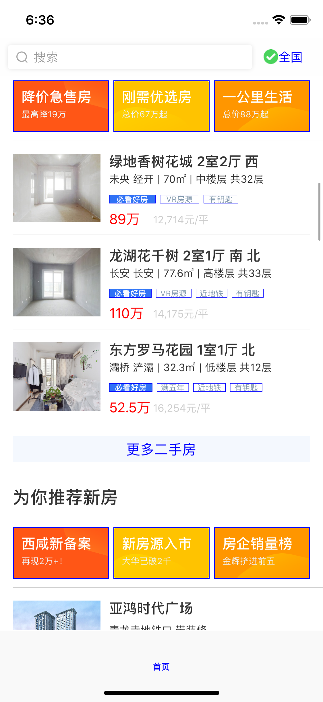
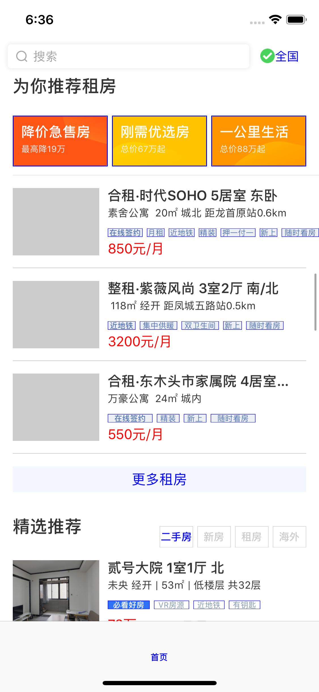
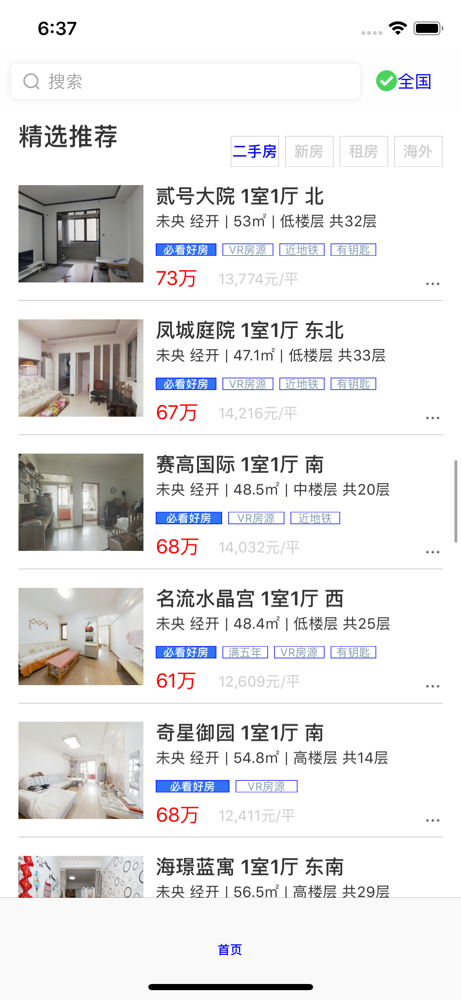
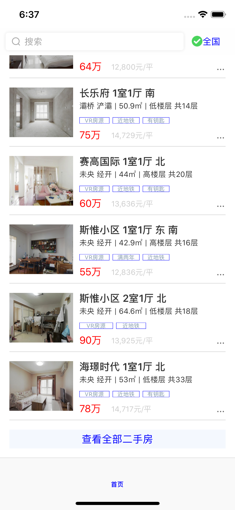

# Dwell-iOS  

&nbsp;&nbsp;&nbsp;&nbsp;&nbsp;&nbsp;&nbsp;&nbsp; Maybe this is the last time to use objective-c. Transfer all in Swift 5+.  

+ API接口数据，来自Charles抓包分析，并使用Postman-MockServer实现模拟请求。  
  

  
  
  
  
  
  
    
